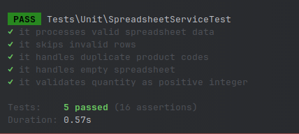

# About Repo
Fresh laravel repo with all task related to ARPM task.

# TO THE READER
- Make sure to add `.env`
- Make sure to run:
  ```
    php artisan migrate
  ```
- Task 3 wont run without these.
---

# Task One solution summary

## Creating Data table
1. I added a formula to generate column header
    ```
    =ARRAY_CONSTRAIN(ARRAYFORMULA("Week " & SEQUENCE(1,52)), 1, 52)
    ```
2. I added a formula to generate row header
    ```
    =ARRAY_CONSTRAIN(ARRAYFORMULA("Individual " & SEQUENCE(10)), 10, 1)
    ```
3. For **Data Table** I used a formula to generate random numbers between 0 and 1 . (10 rows, 52 columns)
   ```
   =RANDARRAY(10, 52)
   ```

## Creating Cumulative Data Sum table
1. I added a formula to generate column header
    ```
    =ARRAY_CONSTRAIN(ARRAYFORMULA("Week " & SEQUENCE(1,52)), 1, 52)
    ```
2. I added a formula to generate row header
    ```
    =ARRAY_CONSTRAIN(ARRAYFORMULA("Individual " & SEQUENCE(10)), 10, 1)
    ```
3. For **Cumulative Data Sum** First I filled cell B16,
    Then added a formula on cell C16
   ```
   =B16+C3
   ```
   Then I just dragged and implemented formula till the end of row and column
4. 

## Creating The line graph.
1. I highlighted the data frame from : A15:BA25
2. Clicked on Insert > Chart 
3. On the "Setup" section, I updated the default chart to line chart
4. Clicked on "Switch rows/ columns" checkbox
5. Clicked on "Use column A as header"
6. Updated/Added labels/titles from "Customize" section

# Output:
- Offline xlsx: [APRM - Cummilative Chart Solution By Momik.xlsx](public/APRM%20-%20Cummilative%20Chart%20Solution%20By%20Momik.xlsx)
- Google sheet: https://docs.google.com/spreadsheets/d/1eaY2Q-NjLw9pIEigB2Zft7T-P2YykavYBFodG5s-n84/edit?usp=sharing

---

# Task Two solution summary

## File Creation
- Used artisan command `php artisan make:controller OrderController` to make [OrderController.php](app/Http/Controllers/OrderController.php) file
- Copy/pasted contents from: https://onlinephp.io/c/8cdb0 to [OrderController.php](app/Http/Controllers/OrderController.php)
- Used artisan command `php artisan make:controller MyImprovedOrderController` to make [OrderController.php](app/Http/Controllers/MyImprovedOrderController.php) file
- Added blank [Order.php](app/Models/Order.php) and [CartItem.php](app/Models/CartItem.php) models just so that I dont get warning lines on my IDE.

## Optimizations Made
1. Strict Typing
  - Change: Added declare(strict_types=1) and specified return type View for the index method.
  - Reason: Makes my app type safe. Reduces the risk of type-related errors and improving code reliability. Also recommended by PSR-12.

2. Eager Loading
  - Change: Used with() to eager load relationships (customer, items, items.product).
  - Reason: Reduces the number of database queries by loading all necessary related data in a single query, improving performance. Basically avoiding N+1 issue.

3. Selective Column Fetching
  - Change: Used select() to fetch only necessary columns from the database.
  - Reason: This minimizes the amount of data transferred from the database, improving efficiency. Better than selecting all column which laravel does by default. 

4. Bulk Data Fetching
  - Change: Used pluck() and whereIn() to fetch related data in bulk.
  - Reason: Reduces the number of queries needed to retrieve last_added_to_cart and completedOrders, optimizing database access.

5. Laravel Collection Methods
  - Change: Replaced manual loops with collection methods like map, sum, count, and sortByDesc.
  - Reason: Improves code clarity, leverages expressive and chainable Laravel features for better maintainability.

6. Centralized Error Handling
  - Change: Wrapped logic in a try-catch block and added error logging.
  - Reason: Ensures exceptions are caught and logged while gracefully handling failures via a fallback error view.

7. Simplified Sorting
  - Change: Replaced nested usort() calls with sortByDesc() on a collection.
  - Reason: Cleaner and more readable sorting by completed_at using Laravel’s built-in collection methods.

8. Use of Arr Helper
  - Change: Used Arr::get and Arr::has to safely access nested array values.
  - Reason: Improves readability and ensures safe data access with default fallbacks.

9. Improved Code Readability
  - Change: Clear variable naming, logical grouping of data operations, and concise formatting.
  - Reason: Enhances code maintainability and makes the logic easier to follow for future developers.

---

# Task Three solution summary

## Crating the migration and model
- Based on the code provided on https://onlinephp.io/c/e9217, I know that the table "products" has column "product_code" and "quantity".
- For simplicity and consistency on tables and model, i've use the column names as the Product Model's attributes.
- Then I manually create a Service class named [SpreadsheetService.php](app/Services/SpreadsheetService.php).
- Copy/pasted the code from source to [SpreadsheetService.php](app/Services/SpreadsheetService.php).

## Writing test
I wrote the test cases based on the current validation implementation:

```php
 Validator::make($row, [
 'product_code' => 'required|unique:products,product_code',
 'quantity'     => 'required|integer|min:1',
]);
```

The tests cover the following scenarios:
- Valid Data Processing - Valid rows are saved to the database, and jobs are dispatched accordingly.
- Invalid Rows Skipping - Rows failing validation (missing product code or invalid quantity) are skipped, ensuring data integrity.
- Duplicate Product Code Handling - Existing product codes are not duplicated; only new products are created and processed.
- Empty Spreadsheet Handling - The system handles empty input gracefully, without dispatching unnecessary jobs.
- Strict Quantity Validation - Ensures quantity is a positive integer (min:1), rejecting zero, negative, or non-integer values.

## Output



---